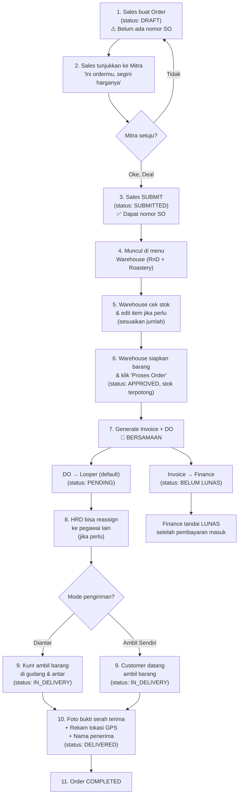

# 📋 PRD & SRS — Fitur Sales Order Module (Sofikopi)

> [!NOTE]
> Dokumen ini telah diperbarui pada 7 Juni 2026 berdasarkan hasil diskusi dan keputusan desain terbaru.

---

## 1. Latar Belakang

Sofikopi saat ini sudah memiliki sistem manajemen produk, mitra, produksi, dan absensi. Namun belum ada sistem untuk **mengelola pesanan penjualan (Sales Order)** dari proses pembuatan order hingga pengiriman barang ke mitra/customer.

Fitur ini akan menghubungkan alur kerja antara **Sales**, **Admin Gudang (RnD/Roastery)**, **HRD**, **Looper (kurir)**, dan **Finance** dalam satu sistem terintegrasi.

---

## 2. Tujuan

- Sales bisa membuat order berdasarkan stok produk yang tersedia
- Sales menunjukkan draft order ke mitra, jika deal baru di-submit
- Admin Gudang (RnD/Roastery) bisa mereview, mengedit item & stok, dan menyiapkan barang
- Dari sales order yang fix, warehouse bisa generate **invoice + delivery order sekaligus**
- HRD bisa meng-assign/reassign kurir pengiriman
- Looper/kurir bisa melihat daftar DO yang di-assign ke mereka, mengantar, dan upload bukti foto + lokasi GPS
- Finance bisa melihat dan mencetak invoice, menandai status pembayaran
- Menyediakan dashboard ringkasan penjualan

---

## 3. Alur Bisnis (Business Flow)

> Berdasarkan transkrip meeting 5 Juni 2026



### Detail Penting dari Meeting:

1. **Draft tanpa nomor**: Saat Sales baru buat order, statusnya `draft` dan **belum ada nomor SO**. Nomor SO baru ter-generate saat di-submit.

2. **Warehouse bisa edit**: Contoh dari meeting — "Sofia mau 30 kilo, tapi stok cuma 20. Warehouse edit jadi 20." Atau "Stok cukup 30, tapi tidak mungkin dikasih keluar semua karena harus pikirkan pelanggan lain."

3. **Invoice & DO sekaligus**: Dari meeting — "Kalau sudah siapkan semua barang, bikinkan invoice dari sales order. Sekalian sama surat jalannya." Jadi warehouse klik satu tombol → generate invoice + DO bersamaan.

4. **DO default ke Looper**: "Pertama kali delivery order itu atas nama looper semua. Tapi yang bisa edit itu bagian HRD." HRD bisa reassign ke siapa saja, bahkan Manager yang kebetulan lewat toko mitra.

5. **Menu DO ada di semua orang**: "Delivery order bisa ngakses semua pegawai ada semua." Menu-nya ada, tapi daftar DO cuma muncul kalau di-assign ke orang tersebut.

6. **Foto + Lokasi**: "Foto saja pas penyerahan barangnya. Sama catat lokasinya pas foto." GPS direkam otomatis saat ambil foto bukti.

7. **DO bisa diedit sebelum sampai**: "Sebelum sampai itu masih bisa diedit siapa yang ngantar. Kecuali kalau sudah sampai statusnya."

---

## 4. Role & Hak Akses

| Role | Akses | Aksi |
|------|-------|------|
| **Sales** (id:8) | Menu: Sales Order | Create draft, tunjukkan ke mitra, submit, lihat order sendiri |
| **RnD** (id:9) | Menu: Kelola Order | Lihat order submitted, edit item & jumlah, approve & generate invoice+DO |
| **Roastery** (id:10) | Menu: Kelola Order | Sama dengan RnD (warehouse) |
| **HRD** (id:6) | Menu: Delivery Order | Lihat semua DO, reassign kurir ke pegawai lain |
| **Looper** (id:4) | Menu: Pengiriman Saya | Lihat DO assigned, antar barang, upload foto+GPS, tandai selesai |
| **Finance** (id: **BARU**) | Menu: Invoice | Lihat daftar invoice, cetak PDF, tandai lunas/belum lunas |
| **Super Admin** (id:1) | Semua menu | Full CRUD |
| **Manager** (id:7) | Dashboard Penjualan + DO | Lihat laporan, bisa terima assign DO dari HRD |
| **Semua Pegawai** | Menu: Delivery Order | Menu tampil, tapi list hanya muncul jika di-assign ke mereka |

> [!IMPORTANT]
> **Role baru yang perlu dibuat:** `Finance` (slug: `finance`, id: 11)

> [!NOTE]
> Menu Delivery Order **harus tampil di semua role** (sesuai meeting). Tapi daftar DO yang muncul hanya yang di-assign ke user tersebut. HRD melihat SEMUA DO untuk keperluan reassign.

---

## 5. Status Flow

### 5.1 Sales Order Status

| Status | Deskripsi | Trigger | Nomor SO |
|--------|-----------|---------|----------|
| `draft` | Order baru dibuat Sales | Sales create | ❌ Belum ada |
| `submitted` | Sales submit setelah deal dengan mitra | Sales submit | ✅ Generate nomor |
| `approved` | Warehouse setujui & siapkan barang, stok terpotong | Warehouse approve | SO/YYYY/XXXX |
| `rejected` | Warehouse tolak | Warehouse reject | SO/YYYY/XXXX |
| `completed` | Barang sudah sampai ke mitra | Auto setelah DO delivered | SO/YYYY/XXXX |

### 5.2 Delivery Order Status

| Status | Deskripsi | Trigger |
|--------|-----------|---------|
| `pending` | DO baru dibuat, default assign ke Looper | Auto saat SO approved |
| `assigned` | HRD sudah reassign (opsional) | HRD reassign |
| `in_delivery` | Barang sedang dikirim/diambil | Kurir mulai kirim |
| `delivered` | Barang sampai + foto bukti + GPS | Kurir upload bukti |

### 5.3 Invoice Status

| Status | Deskripsi | Trigger |
|--------|-----------|---------|
| `belum_lunas` | Invoice terbit, menunggu pembayaran | Auto saat SO approved |
| `lunas` | Pembayaran sudah masuk | Finance tandai lunas |

---

## 6. Dokumen Cetak (DomPDF)

### 6.1 Sales Order (PDF)
- **Diakses oleh:** Sales, Warehouse, Super Admin
- **Format nomor:** `SO/YYYY/XXXX` (auto-increment per tahun, muncul setelah submit)
- **Isi:** Header Sofikopi, info mitra/customer, tabel produk (SKU, nama, sub-kategori, kuantitas, harga, diskon %, pajak, jumlah), summary (subtotal, total diskon, diskon tambahan, pajak, total, jumlah tertagih), status, NPWP

### 6.2 Surat Jalan / Delivery Order (PDF)
- **Diakses oleh:** Looper (dan siapa saja yang di-assign), HRD, Super Admin
- **Format nomor:** `DO/YYYY/XXXX` (auto-increment per tahun)
- **Isi:** Header Sofikopi, ditujukan untuk (nama mitra, alamat, telp), tanggal, tabel produk (no, nama & deskripsi, SKU, kuantitas, unit), area tanda tangan (diterima oleh + dikirim oleh SOFIKOPI)

### 6.3 Invoice (PDF)
- **Diakses oleh:** Finance, Super Admin
- **Format nomor:** `INV/YYMM/XXXX` (auto-increment per bulan)
- **Isi:** Header Sofikopi, referensi, tanggal, tgl jatuh tempo, NPWP, info perusahaan, tagihan untuk (mitra), tabel produk (produk, qty, satuan, harga, disc, jumlah), summary (subtotal, total, jumlah tertagih), info bank (PT. SOFIKOPI GROUP INDONESIA, Bank Mandiri, 1740010036036), syarat & ketentuan

> [!NOTE]
> **DomPDF belum terinstall** di project ini. Perlu ditambahkan dependency `barryvdh/laravel-dompdf`.

---

## 7. Database Schema

### 7.1 Tabel Baru

#### `sales_orders` — Header order

| Kolom | Tipe | Keterangan |
|-------|------|------------|
| id | bigint PK | Auto increment |
| order_number | varchar(50) UNIQUE NULL | Format: SO/YYYY/XXXX — **NULL saat draft, di-generate saat submit** |
| user_id | bigint FK → users | Sales yang buat order |
| mitra_id | bigint FK → mitras NULL | Mitra tujuan (nullable untuk NON MITRA) |
| customer_name | varchar(255) NULL | Nama customer jika NON MITRA |
| customer_phone | varchar(50) NULL | Telp customer jika NON MITRA |
| customer_email | varchar(255) NULL | Email customer jika NON MITRA |
| customer_address | text NULL | Alamat customer jika NON MITRA |
| order_date | date | Tanggal order |
| status | enum | draft, submitted, approved, rejected, completed |
| delivery_type | enum | delivery, self_pickup |
| subtotal | bigint DEFAULT 0 | Total sebelum diskon & pajak |
| discount_total | bigint DEFAULT 0 | Total diskon per-item |
| additional_discount | bigint DEFAULT 0 | Diskon tambahan di level order |
| tax_amount | bigint DEFAULT 0 | Total pajak |
| grand_total | bigint DEFAULT 0 | Total akhir (jumlah tertagih) |
| notes | text NULL | Catatan order |
| approved_by | bigint FK → users NULL | User warehouse yang approve |
| approved_at | timestamp NULL | Waktu approve |
| rejected_reason | text NULL | Alasan reject |
| created_at | timestamp | |
| updated_at | timestamp | |

---

#### `sales_order_items` — Item detail order

| Kolom | Tipe | Keterangan |
|-------|------|------------|
| id | bigint PK | Auto increment |
| sales_order_id | bigint FK → sales_orders | |
| product_id | bigint FK → products | |
| quantity | int | Jumlah pesanan (bisa di-edit warehouse) |
| unit_price | bigint | Harga satuan (selling_price saat order) |
| discount_percent | decimal(5,2) DEFAULT 0 | Diskon persen per item |
| discount_amount | bigint DEFAULT 0 | Diskon nominal per item |
| tax_percent | decimal(5,2) DEFAULT 0 | Pajak persen per item |
| tax_amount | bigint DEFAULT 0 | Pajak nominal per item |
| line_total | bigint | Total per baris |
| created_at | timestamp | |
| updated_at | timestamp | |

---

#### `delivery_orders` — Surat Jalan

| Kolom | Tipe | Keterangan |
|-------|------|------------|
| id | bigint PK | Auto increment |
| do_number | varchar(50) UNIQUE | Format: DO/YYYY/XXXX |
| sales_order_id | bigint FK → sales_orders | |
| assigned_to | bigint FK → users NULL | **Default: user dengan role Looper** |
| assigned_by | bigint FK → users NULL | HRD yang reassign (null jika default) |
| assigned_at | timestamp NULL | Waktu reassign |
| delivery_type | enum | delivery, self_pickup |
| status | enum | pending, assigned, in_delivery, delivered |
| delivery_date | date NULL | Tanggal pengiriman aktual |
| proof_photo | varchar(255) NULL | Path foto bukti serah terima |
| proof_latitude | decimal(10,8) NULL | **Latitude GPS saat foto** |
| proof_longitude | decimal(11,8) NULL | **Longitude GPS saat foto** |
| received_by_name | varchar(255) NULL | Nama penerima |
| notes | text NULL | Catatan pengiriman |
| delivered_at | timestamp NULL | Waktu barang diterima |
| created_at | timestamp | |
| updated_at | timestamp | |

---

#### `invoices` — Faktur tagihan

| Kolom | Tipe | Keterangan |
|-------|------|------------|
| id | bigint PK | Auto increment |
| invoice_number | varchar(50) UNIQUE | Format: INV/YYMM/XXXX |
| sales_order_id | bigint FK → sales_orders | |
| created_by | bigint FK → users | Warehouse/user yang generate |
| invoice_date | date | Tanggal invoice |
| due_date | date | Tanggal jatuh tempo |
| subtotal | bigint | |
| discount_total | bigint DEFAULT 0 | |
| tax_total | bigint DEFAULT 0 | |
| grand_total | bigint | Jumlah tertagih |
| bank_name | varchar(100) DEFAULT 'Bank Mandiri' | |
| bank_account_name | varchar(255) DEFAULT 'PT. SOFIKOPI GROUP INDONESIA' | |
| bank_account_number | varchar(50) DEFAULT '1740010036036' | |
| terms | text NULL | Syarat & ketentuan |
| notes | text NULL | Keterangan |
| status | enum | **belum_lunas, lunas** |
| paid_at | timestamp NULL | Tanggal lunas |
| created_at | timestamp | |
| updated_at | timestamp | |

---

#### `sales_order_logs` — Audit trail perubahan status

| Kolom | Tipe | Keterangan |
|-------|------|------------|
| id | bigint PK | |
| sales_order_id | bigint FK → sales_orders | |
| user_id | bigint FK → users | |
| from_status | varchar(50) NULL | Status sebelum |
| to_status | varchar(50) | Status sesudah |
| notes | text NULL | Catatan (misal: "stok disesuaikan dari 30 ke 20") |
| created_at | timestamp | |

---

### 7.2 Perubahan Tabel Existing

#### Tabel `roles` — Tambah 1 role baru

```sql
INSERT INTO roles (id, name, slug) VALUES (11, 'Finance', 'finance');
```

---

## 8. Menu Sidebar Baru

Menu parent: **Penjualan** (icon: `ri-shopping-cart-2-line`)

| No | Menu | Slug | Path | Deskripsi |
|----|------|------|------|-----------|
| 1 | Sales Order | sales-order.index | /penjualan/sales-order | Sales buat & lihat order (draft + submitted) |
| 2 | Kelola Order | sales-order.manage | /penjualan/kelola-order | Warehouse lihat order submitted, edit, approve |
| 3 | Delivery Order | delivery-order.index | /penjualan/delivery-order | **Semua pegawai** — lihat DO yang di-assign. HRD lihat semua + reassign |
| 4 | Invoice | invoice.index | /penjualan/invoice | Finance lihat & kelola invoice |
| 5 | Dashboard Penjualan | sales-dashboard.index | /penjualan/dashboard | Ringkasan penjualan (Manager, HRD, Super Admin) |

**Total: 5 sub-menu + 1 parent menu**

### Akses per Role:

| Menu | Sales | RnD | Roastery | HRD | Looper | Finance | Manager | Super Admin | Pegawai |
|------|-------|-----|----------|-----|--------|---------|---------|-------------|---------|
| Sales Order | ✅ CRUD | ❌ | ❌ | ❌ | ❌ | ❌ | ❌ | ✅ | ❌ |
| Kelola Order | ❌ | ✅ RUD | ✅ RUD | ❌ | ❌ | ❌ | ✅ R | ✅ | ❌ |
| Delivery Order | ✅ R | ✅ R | ✅ R | ✅ CRUD | ✅ RU | ❌ | ✅ R | ✅ | ✅ R |
| Invoice | ❌ | ❌ | ❌ | ❌ | ❌ | ✅ RU | ✅ R | ✅ | ❌ |
| Dashboard | ❌ | ❌ | ❌ | ✅ R | ❌ | ✅ R | ✅ R | ✅ | ❌ |

> [!NOTE]
> **Delivery Order tampil di semua pegawai** sesuai meeting. Tapi data yang muncul hanya DO yang di-assign ke user tersebut. Khusus HRD bisa lihat semua DO + reassign.

---

## 9. File yang Perlu Dibuat

### 9.1 Models (5 model baru)

| Model | Tabel | File |
|-------|-------|------|
| SalesOrder | sales_orders | `app/Models/SalesOrder.php` |
| SalesOrderItem | sales_order_items | `app/Models/SalesOrderItem.php` |
| DeliveryOrder | delivery_orders | `app/Models/DeliveryOrder.php` |
| Invoice | invoices | `app/Models/Invoice.php` |
| SalesOrderLog | sales_order_logs | `app/Models/SalesOrderLog.php` |

### 9.2 Migrations (5 migration baru)

| File |
|------|
| `create_sales_orders_table.php` |
| `create_sales_order_items_table.php` |
| `create_delivery_orders_table.php` |
| `create_invoices_table.php` |
| `create_sales_order_logs_table.php` |

### 9.3 Repository Pattern (4 set)

| Interface | Repository |
|-----------|------------|
| `SalesOrderRepositoryInterface` | `SalesOrderRepository` |
| `DeliveryOrderRepositoryInterface` | `DeliveryOrderRepository` |
| `InvoiceRepositoryInterface` | `InvoiceRepository` |
| `SalesOrderLogRepositoryInterface` | `SalesOrderLogRepository` |

### 9.4 Services (3 service)

| Service | Tanggung Jawab |
|---------|---------------|
| `SalesOrderService` | CRUD order, submit (generate nomor), approve/reject, potong stok, generate invoice+DO sekaligus |
| `DeliveryOrderService` | Assign/reassign kurir, update status, upload foto+GPS |
| `InvoiceService` | Generate dari SO, tandai lunas/belum lunas, cetak PDF |

### 9.5 Controllers (4 controller)

| Controller | Route Prefix | Keterangan |
|------------|-------------|------------|
| `SalesOrderController` | /penjualan/sales-order | Sales: CRUD draft + submit |
| `SalesOrderManageController` | /penjualan/kelola-order | Warehouse: review, edit, approve, generate invoice+DO |
| `DeliveryOrderController` | /penjualan/delivery-order | HRD: reassign. Semua pegawai: lihat DO sendiri, update status |
| `InvoiceController` | /penjualan/invoice | Finance: lihat, cetak, tandai lunas |
| `SalesDashboardController` | /penjualan/dashboard | Dashboard penjualan |

### 9.6 Form Requests (3 request)

| Request | Keterangan |
|---------|------------|
| `SalesOrderRequest` | Validasi create/update order |
| `DeliveryOrderAssignRequest` | Validasi reassign kurir |
| `InvoiceRequest` | Validasi update invoice |

### 9.7 Views (Blade)

| Folder | File | Keterangan |
|--------|------|------------|
| `pages/penjualan/sales-order/` | index, create, edit, show | Daftar & form buat order (Sales) |
| `pages/penjualan/kelola-order/` | index, show, edit | Manage order (Warehouse: RnD/Roastery) |
| `pages/penjualan/delivery-order/` | index, show | Daftar DO + form reassign (HRD) + form upload bukti (Kurir) |
| `pages/penjualan/invoice/` | index, show | Daftar & detail invoice (Finance) |
| `pages/penjualan/dashboard/` | index | Dashboard penjualan |
| `pages/penjualan/pdf/` | sales-order, delivery-order, invoice | Template PDF (DomPDF) |

### 9.8 Seeders

| Seeder | Keterangan |
|--------|------------|
| `SalesOrderMenuSeeder` | Tambah menu parent + sub-menu + role Finance + permission |

---

## 10. Dependency Baru

| Package | Versi | Kegunaan |
|---------|-------|----------|
| `barryvdh/laravel-dompdf` | ^3.0 | Generate PDF (Sales Order, Surat Jalan, Invoice) |

> [!WARNING]
> Dependency ini perlu di-install via `composer require barryvdh/laravel-dompdf`. Pastikan versi kompatibel dengan PHP 8.2 (sesuai platform config di composer.json). **Jangan ubah versi PHP di project.**

---

## 11. Dashboard Penjualan

| Widget | Tipe | Keterangan |
|--------|------|------------|
| Total Order Bulan Ini | Card angka | Count sales_orders bulan berjalan |
| Total Revenue Bulan Ini | Card angka | Sum grand_total (status: completed) |
| Order Pending Approval | Card angka | Count status: submitted |
| Pengiriman Aktif | Card angka | Count delivery_orders status: pending/assigned/in_delivery |
| Invoice Belum Lunas | Card angka | Count invoices status: belum_lunas |
| Grafik Penjualan | Chart (line/bar) | Trend penjualan 6 bulan terakhir |
| Top 10 Produk Terlaris | Tabel | Produk dengan total qty terbanyak |
| Aktivitas Terbaru | Timeline | 10 log terakhir dari sales_order_logs |

---

## 12. Keputusan Desain & Bisnis (Hasil Diskusi)

> [!NOTE]
> **1. Default Looper**
> Saat ini hanya ada 1 Looper, sehingga tidak membutuhkan mekanisme round-robin. Jika di kemudian hari Looper bertambah, sistem siap menampung penugasan dinamis karena data disimpan dalam tabel `delivery_orders` yang berelasi dengan tabel `users`. Default-nya, sistem akan otomatis memilih user pertama dengan role `looper`.

> [!NOTE]
> **2. Edit Order & Konfirmasi Sales**
> Sales **bisa mengedit order selama status masih `draft`**. Setelah Sales melakukan **Submit**, Sales **tidak bisa merevisi atau mengedit order tersebut lagi**. Yang bisa melakukan penyesuaian/edit hanyalah pihak **Warehouse (RnD/Roastery)**.
> Untuk mencegah kesalahan input sebelum dikirim ke gudang, sistem akan menampilkan **Alert Konfirmasi** (SweetAlert2) agar Sales memverifikasi detail order sekali lagi sebelum benar-benar menekan tombol "Submit".

> [!NOTE]
> **3. Alur Pajak (PPN) & Diskon**
> - **Diskon**: Diinput secara manual oleh Sales (berupa nominal/persentase per item) pada saat membuat draft order.
> - **Pajak (PPN)**: Menggunakan PPN 11% standar. Sistem akan menyediakan opsi centang/checkbox "Gunakan Pajak (PPN 11%)" yang akan menghitung PPN secara otomatis pada total tagihan. Pilihan ini default-nya aktif/tidak aktif sesuai dengan kesepakatan dengan mitra.

> [!NOTE]
> **4. Mode Pengiriman (Delivery Type)**
> Terdapat dua jenis pengiriman:
> - **Diantar (Delivery)**: Pengiriman dilakukan oleh Looper.
> - **Ambil Sendiri (Self Pickup)**: Mitra/customer mengambil sendiri pesanannya ke warehouse.
> Opsi ini ditentukan saat Sales membuat order, namun **Warehouse** memiliki wewenang untuk mengubah/mengonfirmasi pilihan ini ketika melakukan approval pesanan.

---

## 13. Verification Plan

### Manual Verification
1. **Migrate** — jalankan migration, pastikan 5 tabel baru terbuat
2. **Seed** — jalankan seeder, pastikan menu + permission + role Finance terdaftar
3. **Alur lengkap** — test: create draft (tanpa nomor) → submit (dapat nomor) → warehouse edit stok → approve (stok terpotong) → invoice+DO dibuat → HRD reassign → kurir antar + foto + GPS → complete
4. **Cetak PDF** — pastikan 3 dokumen (SO, DO, Invoice) formatnya sesuai gambar referensi
5. **Stok** — pastikan stok terpotong **hanya saat approve**, bukan saat draft/submit
6. **Permission** — pastikan setiap role hanya bisa akses menu sesuai haknya
7. **DO visibility** — pastikan semua pegawai lihat menu DO, tapi list hanya tampil jika di-assign
8. **Dashboard** — pastikan widget menampilkan data yang benar
